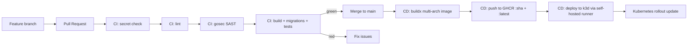

# DevOps-Project

# Go REST API — DevOps CI/CD (GitHub Actions + GHCR + Kubernetes k3d)

This repository contains a **simple Go REST API** backed by **PostgreSQL**.  
The main point of the project is the **DevOps delivery process** around it:

- **CI** on Pull Requests / pushes → lint + SAST + build + tests + migrations + coverage
- **CD** on push to `main` → build & push Docker image to **GHCR** + deploy to **Kubernetes (k3d)**

---

## What this project demonstrates (course topics)

The topics below are aligned with the course list (SDLC, collaborate, source control, branching strategies, building pipelines, CI, CD, security, Docker, Kubernetes, public cloud, IaC, database changes):

- **Collaborate**: team workflow via Pull Requests, reviews, and CI status checks before merge
- **Source control**: GitHub repository as a single source of truth
- **Branching strategies**: feature branches + merge into `main` through PRs
- **Building Pipelines**: GitHub Actions workflows (`ci.yml`, `cd.yml`) define the delivery process as code
- **Continuous Integration**: automated lint + SAST + build + tests + migrations + coverage on PRs (and pushes)
- **Continuous Delivery**: on push to `main` the pipeline publishes a new container image and deploys it to Kubernetes
- **Security**: SAST scanning with **gosec** + required-secrets validation as a pipeline gate
- **Docker**: containerization via `Dockerfile` + consistent runtime environment
- **Kubernetes**: manifests for Namespace, Deployment, Services, and PostgreSQL StatefulSet; rolling updates on new releases
- **Public Cloud**: uses GitHub-hosted services (**GitHub Actions** + **GHCR**) for CI/CD and artifact hosting
- **Infrastructure as Code**: Kubernetes YAML manifests + GitHub Actions YAML (reproducible infrastructure and pipelines)
- **Database changes**: schema migrations executed automatically (init container) and DB deployed as part of the stack (StatefulSet + PVC)

---

## High-level flow

### CI (PR / push → quality & security gate)
CI runs on:
- Pull Requests to `main`
- Pushes to `main`

Pipeline steps:
1. Validate required GitHub secrets exist
2. Setup Go & download dependencies
3. Lint (`golangci-lint`)
4. SAST (`gosec`)
5. Build (`make build`)
6. Run migrations + tests against Postgres (`make migrate`, `make test-cover`)
7. Upload coverage artifact (`coverage-all.out`)

If CI fails → the change should not be merged.

### CD (push to `main` → publish image + deploy)
CD runs on pushes to `main` and includes:
1. Build & push Docker image to GHCR (multi-arch)
    - tags: `:latest` and `:<commit_sha>`
2. Deploy to Kubernetes via a **self-hosted runner** (labels: `self-hosted`, `k3d`)
    - pull image from GHCR
    - import image into k3d
    - apply Kubernetes manifests
    - rollout restart / rollout status checks

---

## Diagram — CI/CD Pipeline

---

## Kubernetes manifests (`deploy/k8s/`)

All Kubernetes resources for the application are stored in the **`deploy/k8s/`** folder.  
This keeps the infrastructure configuration versioned together with the application code (Infrastructure as Code).

### 1) `namespace.yml`
Creates a dedicated namespace for the whole stack:

- **Namespace:** `go-rest`

This isolates the project resources from other workloads in the cluster. :contentReference[oaicite:0]{index=0}

---

### 2) `postgres-service.yml`
Creates a **headless Service** for PostgreSQL:

- `clusterIP: None` (headless service)
- Exposes port `5432`
- Selects pods with label `app: postgres`

A headless service is commonly used with StatefulSets so the DB can be reached reliably through stable DNS (e.g. `postgres.go-rest.svc.cluster.local`). :contentReference[oaicite:1]{index=1}

---

### 3) `postgres-statefulset.yml`
Runs PostgreSQL as a **StatefulSet** with persistent storage:

- **Image:** `postgres:15-alpine`
- **Replicas:** `1`
- Uses a PVC template (`pgdata`) with **1Gi** storage
- Loads credentials from the Kubernetes Secret `postgres-secret`
- Uses `PGDATA=/var/lib/postgresql/data/pgdata`
- Has **readiness** and **liveness** probes using `pg_isready`
- Uses `fsGroup: 999` so Postgres can write to the mounted volume

This ensures the database data survives Pod restarts. :contentReference[oaicite:2]{index=2}

---

### 4) `deployment.yml`
Deploys the Go REST API as a **Deployment** and ensures DB migrations run automatically before the app starts.

**Key points:**
- **Deployment name:** `go-rest-api`
- **Namespace:** `go-rest`
- **Replicas:** `1`
- Two **initContainers**:

1) `copy-migrations`
    - Uses the same app image (`ghcr.io/...:latest`)
    - Copies `/app/migrations` into a shared `emptyDir` volume mounted at `/migrations`

2) `migrate`
    - Uses `migrate/migrate:v4.19.1`
    - Reads the DSN from `/etc/go-rest-api/config.yml` (mounted from secret)
    - Retries migrations up to 30 times before failing

**Main container:**
- Runs `./server -config /etc/go-rest-api/config.yml`
- Exposes port `8080`

**Volumes:**
- `app-config`: secret `go-rest-api-config` mounted to `/etc/go-rest-api`
- `migrations`: `emptyDir` shared between init containers and the app

This pattern guarantees the schema is applied before the API begins serving traffic. :contentReference[oaicite:3]{index=3}

---

### 5) `service.yml`
Exposes the Go API inside the cluster using a **ClusterIP Service**:

- **Service name:** `go-rest-api`
- Port `80` → targetPort `8080`
- Selects pods with label `app: go-rest-api`

This enables internal cluster communication and is also convenient for local access via `kubectl port-forward`. :contentReference[oaicite:4]{index=4}

---

